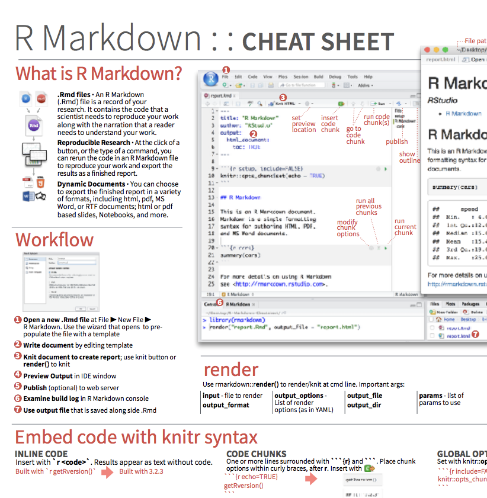

```{r child = "../setup.Rmd"}
```

```{r packages, echo=FALSE, message=FALSE, warning=FALSE}
library(tidyverse)
library(viridis)
library(sugrrants)
library(lubridate)
```

## Learning goals

By the end of the course, you will be able to...

--

- gain insight from data

--
- gain insight from data, **reproducibly**

--
- gain insight from data, reproducibly, **using modern programming tools and techniques**

--
- gain insight from data, reproducibly **and collaboratively**, using modern programming tools and techniques

--
- gain insight from data, reproducibly **(with literate programming and version control)** and collaboratively, using modern programming tools and techniques

---

class: middle

# Reproducible data analysis

---

## Reproducibility checklist

.question[
What does it mean for a data analysis to be "reproducible"?
]

--

Near-term goals:

- Are the tables and figures reproducible from the code and data?
- Does the code actually do what you think it does?
- In addition to what was done, is it clear *why* it was done? 

Long-term goals:

- Can the code be used for other data?
- Can you extend the code to do other things?

---

## Toolkit for reproducibility

- Scriptability $\rightarrow$ R
- Literate programming (code, narrative, output in one place) $\rightarrow$ R Markdown
- Version control $\rightarrow$ Git / GitHub

---

## Course toolkit

<br>

.pull-left[
### .gray[Doing data science]
- .gray[Programming:]
  - .gray[R]
  - .gray[RStudio]
  - .gray[tidyverse]
  - .gray[R Markdown]
- .pink[Version control and collaboration:]
  - .pink[Git]
  - .pink[GitHub]
]

---

class: middle

# Git and GitHub

---

## Git and GitHub

.pull-left[
```{r echo=FALSE, out.width="25%"}
#| fig-alt: git logo
knitr::include_graphics("img/git-logo.png")
```
- Git is a version control system -- like “Track Changes” features from Microsoft Word, on steroids
- It's not the only version control system, but it's a very popular one
]
.pull-right[
```{r echo=FALSE, out.width="25%"}
#| fig-alt: GitHub logo
knitr::include_graphics("img/github-logo.png")
```
- GitHub is the home for your Git-based projects on the internet -- like DropBox but much, much better

- We will use GitHub as a platform for web hosting and collaboration (and as our course management system!)
]

---

## Versioning

```{r echo=FALSE, fig.align = "center", out.width = "70%"}
#| fig-alt: |
#|   Stacked Lego bricks: v1, ..., v12.
knitr::include_graphics("img/lego-steps.png")
```

---

## Versioning 

### with human readable messages

```{r echo=FALSE, fig.align = "center", out.width = "60%"}
#| fig-alt: |
#|   Lego with human-readable message
#|   First commit
#|   v1
#|   v5
#|   Finished second floor
#|   v9
#|   Starting to close up the roof
#|   v2
#|   Built back and front of base
#|   v6
#|   Started on the roof
#|   v10
#|   All but top of roof built
#|   v3
#|   Finished building base
#|   v7
#|   Rootwork and archway
#|   v11
#|   Still needs final shingles
#|   V4
#|   Second floor back and front
#|   Done!!!
#|   v8
#|   Building up the roof
#|   v12.
knitr::include_graphics("img/lego-steps-commit-messages.png")
```

---

## Why do we need version control?

```{r echo=FALSE, fig.align = "center", out.width="35%"}
#| fig-alt: |
#|   phd comics
#|   FINAL.doc!
#|   JORGE CHAM ©2012
#|   FINAL_rev.6.COMMENTS.doc
#|   "FINAL"doc
#|   track changes
#|   FINAL_rev.2.doc
#|   FINAL_rev.8.comments5.
#|   CORRECTIONS.doc
#|   FINAL_rev.18.comments7. FINAL_rev.22.comments49.
#|   corrections9.MORE.30.doc
#|   corrections.10.#@$%WHYDID
#|   ICOMETOGRADSCHOOL????.doc
#|   WWW.PHDCOMICS.COM.
knitr::include_graphics("img/phd_comics_vc.gif")
```

---

## How will we use Git and GitHub?

```{r echo=FALSE, out.width="100%"}
#| fig-alt: GitHub organization page
knitr::include_graphics("img/whole-game-01.png")
```

---

## How will we use Git and GitHub?

```{r echo=FALSE, out.width="100%"}
#| fig-alt: Select repo under organization on GitHub
knitr::include_graphics("img/whole-game-02.png")
```

---

## How will we use Git and GitHub?

```{r echo=FALSE, out.width="100%"}
#| fig-alt: Clone the repo on GitHub
knitr::include_graphics("img/whole-game-03.png")
```

---

## How will we use Git and GitHub?

```{r echo=FALSE, out.width="100%"}
#| fig-alt: Pull and push commits from and to repo on GitHub
knitr::include_graphics("img/whole-game-04.png")
```

---

# Git and GitHub tips

- There are millions of git commands -- ok, that's an exaggeration, but there are a lot of them -- and very few people know them all. 99% of the time you will use git to add, commit, push, and pull.

--
- We will be doing Git things and interfacing with GitHub through RStudio, but if you google for help you might come across methods for doing these things in the command line -- skip that and move on to the next resource unless you feel comfortable trying it out.

--
- There is a great resource for working with git and R: [happygitwithr.com](http://happygitwithr.com/). Some of the content in there is beyond the scope of this course, but it's a good place to look for help.

---

## Tour: Git and GitHub

- Create a GitHub account
- Verify your GitHub email
- Adjust your GitHub settings for a more pleasant GitHub experience

.footnote[
<sup>+</sup>Just like a real data scientist!
]

---

## Course toolkit

<br>

.pull-left[
### .pink[Doing data science]
- .pink[Programming:]
  - .pink[R]
  - .pink[RStudio]
  - .pink[tidyverse]
  - .pink[R Markdown]
- .gray[Version control and collaboration:]
  - .gray[Git]
  - .gray[GitHub]
]

---

class: middle

# R and RStudio

---

## R and RStudio

.pull-left[
```{r echo=FALSE, out.width="25%"}
#| fig-alt: R logo
knitr::include_graphics("img/r-logo.png")
```
- R is an open-source statistical **programming language**
- R is also an environment for statistical computing and graphics
- It's easily extensible with *packages*
]
.pull-right[
```{r echo=FALSE, out.width="50%"}
#| fig-alt: RStudio logo
knitr::include_graphics("img/rstudio-logo.png")
```
- RStudio is a convenient interface for R called an **IDE** (integrated development environment), e.g. *"I write R code in the RStudio IDE"*
- RStudio is not a requirement for programming with R, but it's very commonly used by R programmers and data scientists
]

---

## R packages

- **Packages** are the fundamental units of reproducible R code. They include reusable R functions, the documentation that describes how to use them, and sample data<sup>1</sup>

There are over 16,000 R packages available on **CRAN** (the Comprehensive R Archive Network)<sup>2</sup>

- We're going to work with a small (but important) subset of these!

.footnote[
<sup>1</sup> Wickham and Bryan, [R Packages](https://r-pkgs.org/).

<sup>2</sup> [CRAN contributed packages](https://cran.r-project.org/web/packages/).
]

---

## Tour: R and RStudio

```{r echo=FALSE, out.width="80%"}
#| fig-alt: R and RStudio demo screenshot
knitr::include_graphics("img/tour-r-rstudio.png")
```

---

## A short list (for now) of R essentials

- Functions are (most often) verbs, followed by what they will be applied to in parentheses:

```{r eval=FALSE}
verb(object)
eat(food) #<<
do_that(to_this, to_that, with_those)
```

--

- Packages are installed with the `install.packages` function and loaded with the `library` function, once per session:

```{r eval=FALSE}
install.packages("package_name")
library(package_name)
```

---

## R essentials (continued)

- Columns (variables) in data frames are accessed with `$`:

.small[
```{r eval=FALSE}
dataframe$var_name
```
]

--

- Object documentation can be accessed with `?`

```{r eval=FALSE}
?mean
```

---

## tidyverse

.pull-left[
```{r echo=FALSE, out.width="99%"}
#| fig-alt: tidyverse logo
knitr::include_graphics("img/tidyverse.png")
```
]

.pull-right[
.center[.large[
[tidyverse.org](https://www.tidyverse.org/)
]]

- The **tidyverse** is an opinionated collection of R packages designed for data science
- All packages share an underlying philosophy and a common grammar
]

---

## rmarkdown

.pull-left[
.center[.large[
[rmarkdown.rstudio.com](https://rmarkdown.rstudio.com/)
]]

- **rmarkdown** and the various packages that support it enable R users to write their code and prose in reproducible computational documents
- We will generally refer to R Markdown documents (with `.Rmd` extension), e.g. *"Do this in your R Markdown document"* and rarely discuss loading the rmarkdown package
]

.pull-right[
```{r echo=FALSE, out.width="60%"}
#| fig-alt: R Markdown logo
knitr::include_graphics("img/rmarkdown.png")
```
]

---

class: middle

# R Markdown

---


## R Markdown

- Fully reproducible reports -- each time you knit the analysis is ran from the beginning
- Simple markdown syntax for text
- Code goes in chunks, defined by three backticks, narrative goes outside of chunks

---

## Tour: R Markdown

```{r echo=FALSE, out.width="90%"}
#| fig-alt: R Markdown demo screenshot
knitr::include_graphics("img/tour-rmarkdown.png")
```

---

## R Markdown help

.pull-left[
.center[
.midi[R Markdown Cheat Sheet  
`Help -> Cheatsheets`]
]
```{r echo=FALSE, out.width="80%"}
#| fig-alt: Rmd cheatsheet

```
]
.pull-right[
.center[
.midi[Markdown Quick Reference  
`Help -> Markdown Quick Reference`]
]
```{r echo=FALSE, out.width="80%"}
#| fig-alt: Markdown Quick Reference
knitr::include_graphics("img/md-cheatsheet.png")
```
]

---

## How will we use R Markdown?

- Every assignment / report / project / etc. is an R Markdown document
- You'll always have a template R Markdown document to start with
- The amount of scaffolding in the template will decrease over the semester

---

.your-turn[
.light-blue[.hand[Your turn:]] `Cumulative deaths from COVID-19`
- Clone (download) [https://github.com/uiuc-ischool-20231-jseo1005-1/rmarkdown_practice](https://github.com/uiuc-ischool-20231-jseo1005-1/rmarkdown_practice)
- Open and knit the R Markdown document `covid.Rmd`.
]
