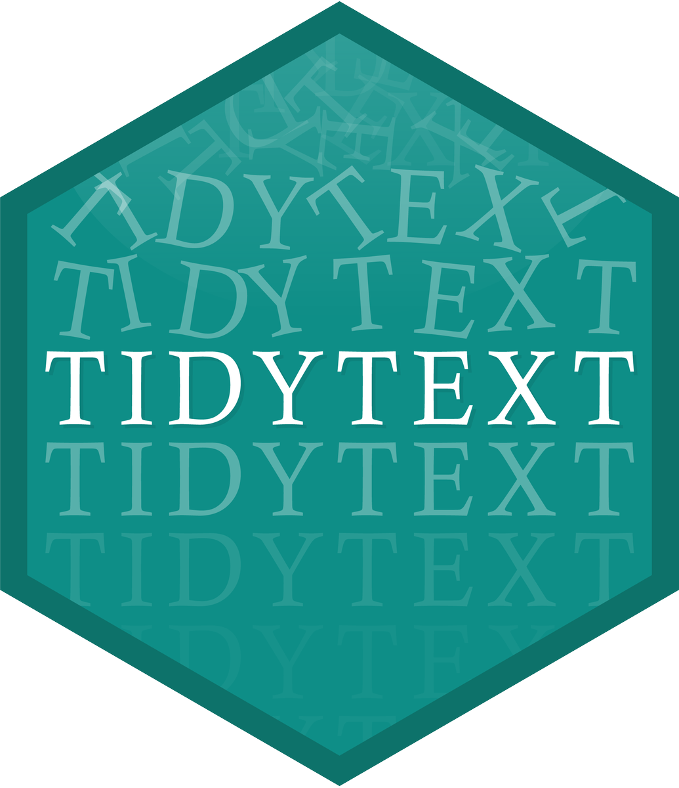

```{r child = "../setup.Rmd"}
```

```{r packages, echo = FALSE, message=FALSE, warning=FALSE}
library(tidyverse)
library(tidytext)
```

class: middle

# Tidytext analysis

---

## Tidytext

.pull-left[
- Using tidy data principles can make many text mining tasks easier, more effective, and consistent with tools already in wide use
- Learn more at [tidytextmining.com](https://www.tidytextmining.com/)
]
.pull-right[
```{r echo=FALSE, fig.align = "left"}

```
]

---

## What is tidy text?

.pull-left-wide[
.small[
```{r}
text <- c(
  "Oh! Get me away from here, I'm dying",
  "Play me a song to set me free",
  "Nobody writes them like they used to",
  "So it may as well be me",
  "Here on my own now after hours",
  "Here on my own now on a bus",
  "Think of it this way",
  "You could either be successful or be us",
  "With our winning smiles, and us",
  "With our catchy tunes or worse",
  "Now we're photogenic",
  "You know, we don't stand a chance"
)

text
```
]
]

---

## What is tidy text?

```{r}
text_df <- tibble(line = 1:12, text = text)

text_df %>% print(n = 12)
```

---

## What is tidy text?

```{r}
text_df %>%
  unnest_tokens(word, text) %>%
  print(n = 10)
```

---

class: middle

# Case study: Analyzing Jane Austen's novels

.footnote[
Source: [**Text Mining with R** Ch1](http://tidytextmining.com/), by Julia Silge and David Robinson.
]

---

## Data wrangling

```{r original_books}
library(tidyverse)
library(tidytext)
library(janeaustenr)

original_books <- austen_books() %>%
  group_by(book) %>%
  mutate(
    linenumber = row_number(),
    chapter = cumsum(str_detect(
      text,
      regex("^chapter [\\divxlc]",
        ignore_case = TRUE
      )
    ))
  ) %>%
  ungroup()

original_books
```

---

## Tokenization

```{r tidy_books_raw}
tidy_books <- original_books %>%
  unnest_tokens(word, text)

tidy_books
```

---

## Word count

```{r}
tidy_books %>%
  count(word, sort = TRUE)
```

---

## Stopwords

```{r}
stop_words
```

---

## Removing stopwords

```{r tidy_books}
tidy_books <- tidy_books %>%
  anti_join(stop_words)
```

---

## Word count: The most common words in all the books as a whole

```{r}
tidy_books %>%
  count(word, sort = TRUE)
```

---

## Visualization of the most common words 

.panelset[
.panel[.panel-name[Plot]
```{r ref.label = "plotcount", echo = FALSE, warning = FALSE, out.width = "70%", fig.width = 8}
```
]
.panel[.panel-name[Code]

```{r plotcount, fig.cap="The most common words in Jane Austen's novels", fig.show = "hide"}
tidy_books %>%
  count(word, sort = TRUE) %>%
  filter(n > 600) %>%
  mutate(word = reorder(word, n)) %>%
  ggplot(aes(n, word)) +
  geom_col() +
  labs(y = NULL)
```

]
]

---

## H.G. Wells science fiction and fantasy novels

.pull-left[

- [*The Time Machine*](https://www.gutenberg.org/ebooks/35).

- [*The War of the Worlds*](https://www.gutenberg.org/ebooks/36).

- [*The Invisible Man*](https://www.gutenberg.org/ebooks/5230).

- [*The Island of Doctor Moreau*](https://www.gutenberg.org/ebooks/159).

]

.pull-right[
```{r}
library(gutenbergr)

hgwells <- gutenberg_download(c(35, 36, 5230, 159))
```
]

---

## Tidying + stopword removal

```{r tidy_hgwells}
tidy_hgwells <- hgwells %>%
  unnest_tokens(word, text) %>%
  anti_join(stop_words)
```

---

## The most common words in these novels of H.G. Wells?

```{r}
tidy_hgwells %>%
  count(word, sort = TRUE)
```

---


## Download some works of the Brontë sisters, whose lives overlapped with Jane Austen's somewhat but who wrote in a rather different style

```{r}
bronte <- gutenberg_download(c(1260, 768, 969, 9182, 767))
```

---

## Tidying + stopwords removal

```{r tidy_bronte}
tidy_bronte <- bronte %>%
  unnest_tokens(word, text) %>%
  anti_join(stop_words)
```

---

## The most common words in these novels of the Brontë sisters?

```{r}
tidy_bronte %>%
  count(word, sort = TRUE)
```

---

## Compare the frequency for each word for the works of Jane Austen, the Brontë sisters, and H.G. Wells 

.panelset[
.panel[.panel-name[Output]
```{r ref.label = "frequency", echo = FALSE, warning = FALSE}
```
]
.panel[.panel-name[Code]
```{r frequency, results = "hide"}
frequency <- bind_rows(
  mutate(tidy_bronte, author = "Brontë Sisters"),
  mutate(tidy_hgwells, author = "H.G. Wells"),
  mutate(tidy_books, author = "Jane Austen")
) %>%
  mutate(word = str_extract(word, "[a-z']+")) %>%
  count(author, word) %>%
  group_by(author) %>%
  mutate(proportion = n / sum(n)) %>%
  select(-n) %>%
  pivot_wider(names_from = author, values_from = proportion) %>%
  pivot_longer(`Brontë Sisters`:`H.G. Wells`,
    names_to = "author", values_to = "proportion"
  )

frequency
```
]
]

---

## Visualization: Compare the word frequencies for the works of Jane Austen, the Brontë sisters, and H.G. Wells 


.panelset[
.panel[.panel-name[Plot]
```{r ref.label = "plotcompare", echo = FALSE, warning = FALSE, out.width = "70%", fig.width = 8}
```
]
.panel[.panel-name[Code]

```{r plotcompare, fig.cap="Comparing the word frequencies of Jane Austen, the Brontë sisters, and H.G. Wells", fig.show = "hide"}
library(scales)

# expect a warning about rows with missing values being removed
ggplot(frequency, aes(
  x = proportion, y = `Jane Austen`,
  color = abs(`Jane Austen` - proportion)
)) +
  geom_abline(color = "gray40", lty = 2) +
  geom_jitter(alpha = 0.1, size = 2.5, width = 0.3, height = 0.3) +
  geom_text(aes(label = word), check_overlap = TRUE, vjust = 1.5) +
  scale_x_log10(labels = percent_format()) +
  scale_y_log10(labels = percent_format()) +
  scale_color_gradient(
    limits = c(0, 0.001),
    low = "darkslategray4", high = "gray75"
  ) +
  facet_wrap(~author, ncol = 2) +
  theme(legend.position = "none") +
  labs(y = "Jane Austen", x = NULL)
```

]
]


---

## Correlation test: quantify how similar and different these sets of word frequencies are

### Brontë Sisters vs. Jane Austen

.panelset[
.panel[.panel-name[Output]
```{r ref.label = "cor_test1", echo = FALSE, warning = FALSE}
```
]
.panel[.panel-name[Code]
```{r cor_test1, results = "hide"}
cor.test(
  data = frequency[frequency$author == "Brontë Sisters", ],
  ~ proportion + `Jane Austen`
)
```
]
]

---

## Correlation test: quantify how similar and different these sets of word frequencies are

### H.G. Wells vs. Jane Austen

.panelset[
.panel[.panel-name[Output]
```{r ref.label = "cor_test2", echo = FALSE, warning = FALSE}
```
]
.panel[.panel-name[Code]
```{r cor_test2, results = "hide"}
cor.test(
  data = frequency[frequency$author == "H.G. Wells", ],
  ~ proportion + `Jane Austen`
)
```
]
]

---

## What is a document about?

- Term frequency
- Inverse document frequency

$$idf(\text{term}) = \ln{\left(\frac{n_{\text{documents}}}{n_{\text{documents containing term}}}\right)}$$

tf-idf is about comparing **documents** within a **collection**
